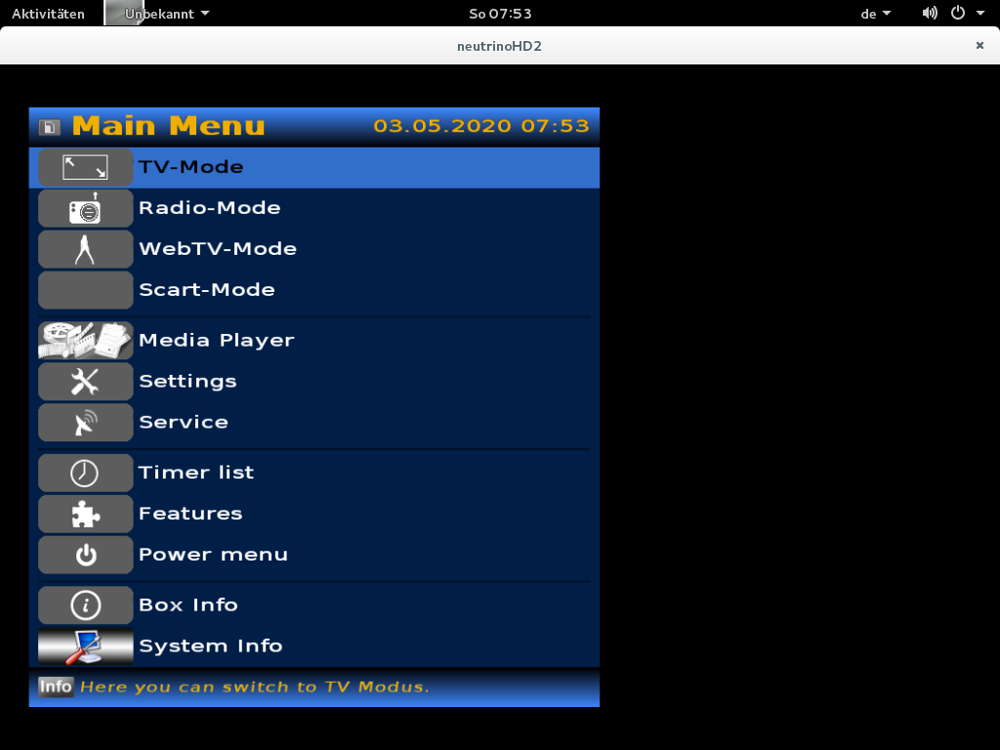
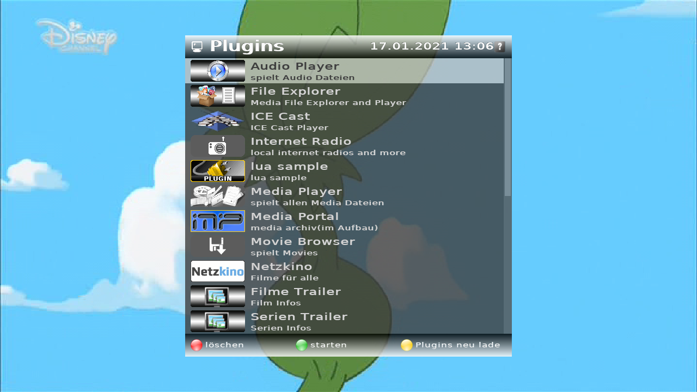
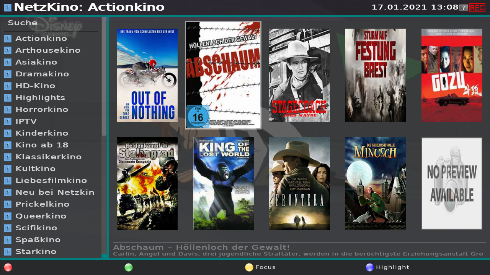
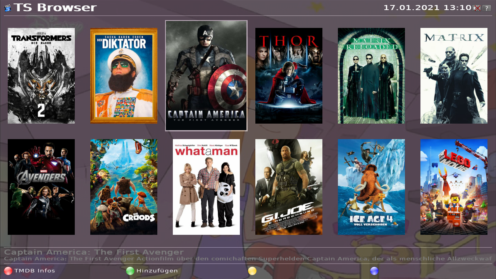

<h1 align="center">
  Welcome to neutrinoHD2 software
</h1>

  

  

  

  

neutrinoHD2 GUI software for:

- **sh4 SoC based STB** (dgs,ipbox,cuberevo,fulan,kathrein,topfield,fortis_hdbox,octagon,atevio,adb_box,whitebox,vip,homecast).

- **bcm mipsel SoC based STB** (gigablue,dreambox,xtrend,vuplus,azbox,technomate,venton,ixuss,iqonios,xp1000,e3hd,ebox5000,odin)

- **arm cortex SoC based STB** (hypercube).

- **generic** (linux DVB-API)

- **x86** (PC). 
